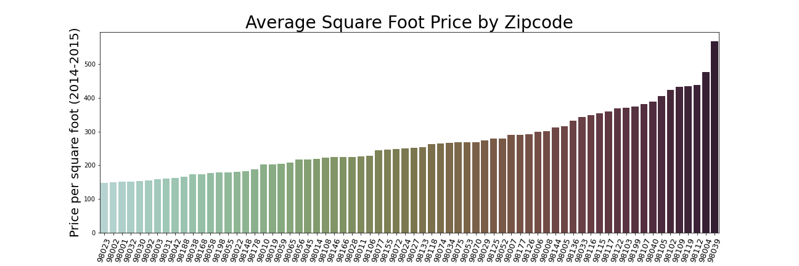
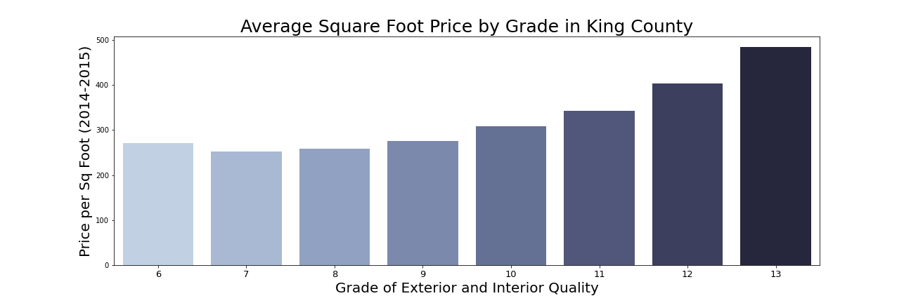
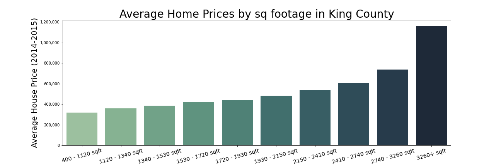

# Phase 2 Project: Non-Technical Presentation of Price Predictor

  

#  Price Estimation and Analysis   for King County Houses

**Authors:** Dmitriy Fisch

## Overview

&emsp;&emsp; Our objective is to identify key factors which affect house pricing   &emsp;&emsp;   in King County
and use those factors in house price prediction.  

## How can we estimate a fair price in a growing   Real Estate market?

Per [Seattle Met Staff](https://www.seattlemet.com/home-and-real-estate/2022/01/how-expensive-is-a-house-in-seattle-bellevue-redmond-washington) article (Jan 2022):
- #### In 2012 an average price of a house in King County was \$424,000
- #### By 2020, prices rose significantly—to \$880,000! 
- #### In 2021 it is \$1,055,632. 

**Knowing the average is not enough!**

  
 
 #  The Main Three Price Factors  
 ***
  * Location (zipcode)
   
  * Quality of materials, construction and design (grade)
   
  * Square Footage (not counting a basement)  
  

### Location is important!
&nbsp;&nbsp;&nbsp;&nbsp;Based on a zipcode average sq. ft. price can increase 300%!

 

 

#### Quality is important! 
Price per square foot doubles when comparing 
   lowest and highest construction grades  </li> 

   </body> 
   

   
   
<body> &emsp;  <h2> Size does matter! </h2>  
   <li>   Larger houses as expected are sold  for more money. </li>    </body> 
   
   
   

   
  
  # Other Important Features  

  * #### View
  * #### Frontage along the water
    
  * more...
  

 

# Too many factors?
Challenges:
*  How multiple features above work together?
*  Quantifying joined features effect
*  Building a predictive model
* Building a front end for a customer

   
  
# Solution

*  Analyzing 2014-2015 dataset with past sales
*  Identifying individual and joined factors.
*  Prepairing features for the model
*  Calculate all the features coefficients 
*  Testing the results

# Data
***
#### King County house sales dataset contains:
*  details for 22,000 sold houses
*  final sales prices 

All the data is from 2014-2015 

# Features Identified
#### Main Features: 
* House Sq footage 
* Grade of design and materials quality
* Zipcode
* Waterfront
* View

## Additional Features: 
* Lot size
* Basement
* House Age

#### Only marginal effect from:
* Number of bedrooms, bathrooms, and floors

# Data Modeling
#### An iterative approach to data modeling 
-  Calculating Efficiency for basic features  
-  Prepairing model features
-  Training multiple models
-  Chosing the most efficient model 
-  Testing against different subset of data

#### Building a Front End Tool:

   

# Testing
***

We made sure the tool works as expected:
* Multiple comparissons of predicted data against the actual data
* Predicted price is within 90-110% of actual price (houses newer than 1980)
* Predicted price is within 87-113% of actual price (houses older than 1980)
***

# Conclusions
***

#### Considerations and Limitations:

* The tool can be effective to estimate base price for known features
* In the future a model should be re-trained with more up-to-date data
* The presented prototype will be greatly improved by more advanced modeling

